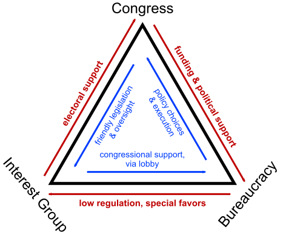

# Actor Interaction in the Policy Process

## POSC 315: Lecture 5.2

---

## Overview

- Concepts of interaction:
    - Policy domain
    - Policy community
    - Subgovernment & issue networks
    - Iron triangle
    - Policy regime

---

## Policy Domain

**Definition:**  
“A substantive area of public policy such as health care, education, or the environment.” — Stone

- Can be a single policy or a cluster of related policies
- Area where actors compete and compromise

---

## Policy Community

**Definition:**  
The group of actors involved in a particular policy domain

- Includes officials, organizations, interest groups, and individuals

---

## Subgovernment

**Definition:**  
“A network of groups within the American political system that exercise a great deal of control over specific policy areas.” — Stone

- Typically stable, closed, and long-lasting
- Includes congressional committees, bureaucratic agencies, and interest groups
- Often called "subgovernments" because of their influence over policy details

---

## Issue Networks

**Definition:**  
A more open and fluid set of relationships among actors interested in a policy area.

- Includes interest groups, think tanks, corporations, experts, media, and individuals
- Membership and influence can shift over time
- More dynamic and less predictable than subgovernments
- Reflects the complexity and diversity of modern policymaking

---

## Iron Triangle

**Definition:**  
“A stable, mutually beneficial political relationship among a congressional committee (or subcommittee), an administrative agency, and organized interests concerned with a particular policy domain.” — Stone

**Example:**  
House Committee on Energy & Commerce, the EPA, and the American Petroleum Institute

- Iron triangles are more closed than issue networks

---

## Iron Triangle Visual

---

## Iron Triangle Components

- **Congressional Committees:** Write and oversee legislation
- **Administrative Agencies:** Implement and regulate policy
- **Interest Groups:** Advocate and provide resources
- Each group supports and reinforces the others
- Creates a stable, mutually beneficial relationship
- Often limits outside influence

---

- **Congressional Committees:** Write and oversee legislation
- **Administrative Agencies:** Implement and regulate policy
- **Interest Groups:** Advocate and provide resources
- Each group supports and reinforces the others
- Creates a stable, mutually beneficial relationship
- Often limits outside influence

---

## Policy Regime

**Definition:**  
“A loosely formed governance structure formed by a policy community around a particularly broad policy domain.” — Birkland

- Spans boundaries and includes many actors, coalitions, interests, and agencies
- Forms a “loose” governance structure around big, complex issues

---

# Conclusion

- Policy domains are defined by their actors and their interactions
- Networks and coalitions shape who has influence
- Subgovernments, iron triangles, and policy regimes help explain how unofficial and official actors share power and shape outcomes

---